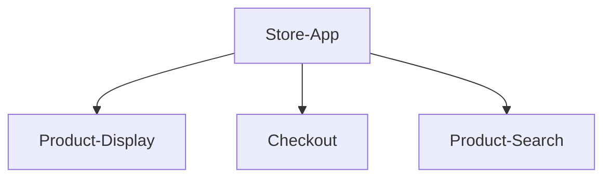

# Micro FrontEnd Architecture

**Traditional Monolithic Architecture**
In a traditional monolithic frontend architecture, component trees are used 
```mermaid
    graph TD;
        Store-App-->[n]-components;
```

---
**Equivalent Micro FrontEnd Architecture**


## Benefits
*  Faster Development (for larger projects)
*  Deployment Independence
*  Smaller Codebases
*  Simplified Testing