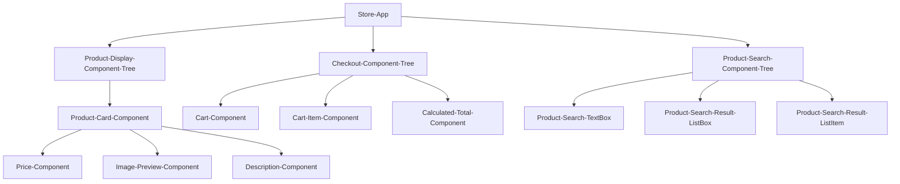
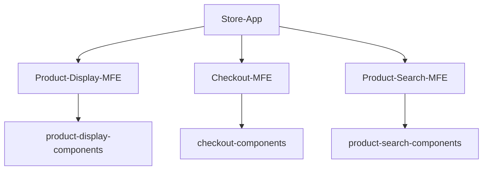

# Micro FrontEnd Architecture

**Component Architecture** - 
When building a front end application in javascript, it is important to encapsulate code within code blocks of single responsibility.  While this is a generally known coding principle, it is incredibly important in a dynamically typed language like javascript.  Having code that is tied to a single responsibility makes it much easier to write both unit and integration tests. The more tests, the more reliable the code.  In modern Javascript frameworks this single responsiblity ends up being a foundational principle in how the frameworks are structured.  The encapsulated code block is called a "component" and both React and Angular use "component hierarchies" to manage development.  Building a front end using components and component hierarchies makes the code base a lot more manageable and testable.

**NOTE:** - For the duration of the article, I will use an example of a marketplace (i.e. Amazon) to describe patterns.

**Monolithic Architecture** -
In a monolithic frontend architecture (not to be confused with a mono repo which is focused on single repo containing multiple applications and libraries), an application is designed to match the component hierarchy of the application.  So for the marketplace, you would have an architecture similar to:

---
**Equivalent Micro FrontEnd Architecture**

## Benefits
*  Faster Development (for larger projects)
*  Deployment Independence
*  Smaller Codebases
*  Simplified Testing