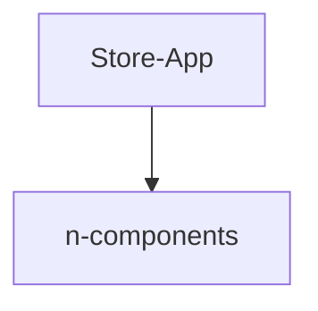
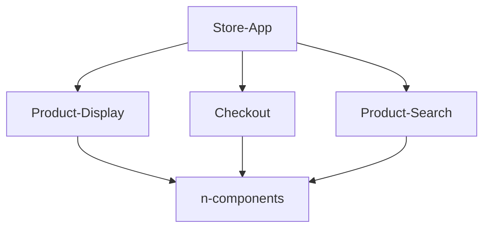

# Micro FrontEnd Architecture

**Traditional Monolithic Architecture**
In a traditional monolithic frontend architecture, component trees are used to segment responsibility of work.  These component architectures 

---
**Equivalent Micro FrontEnd Architecture**

## Benefits
*  Faster Development (for larger projects)
*  Deployment Independence
*  Smaller Codebases
*  Simplified Testing