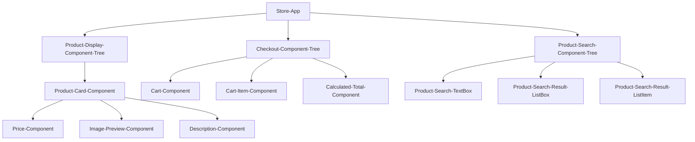
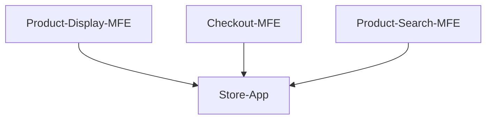
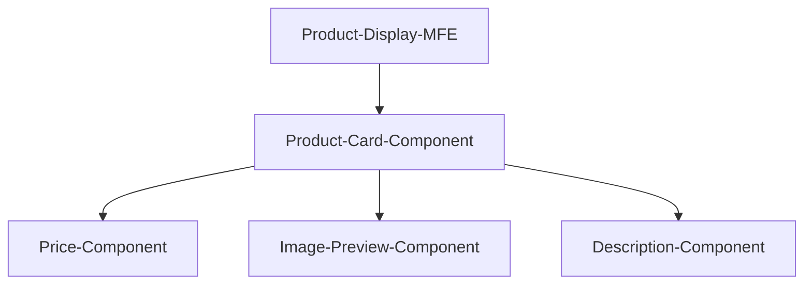
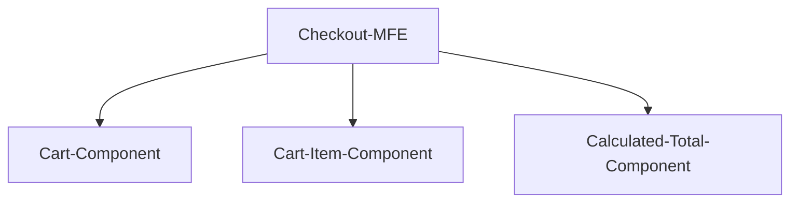
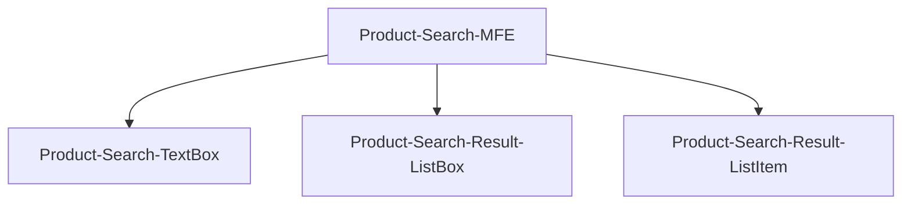

# Micro FrontEnd Architecture

# What Is It
### Component Architecture
When building a front end application in javascript, it is important to encapsulate code within code blocks of single responsibility.  While this is a generally known coding principle, it is incredibly important in a dynamically typed language like javascript.  Having code that is tied to a single responsibility makes it much easier to write both unit and integration tests. The more tests, the more reliable the code.  In modern Javascript frameworks this single responsiblity ends up being a foundational principle in how the frameworks are structured.  The encapsulated code block is called a "component" and both React and Angular use "component hierarchies" to manage development.  Building a front end using components and component hierarchies makes the code base a lot more manageable and testable.

**NOTE:** - For the duration of the article, I will use an example of a marketplace (i.e. Amazon) to describe patterns.

### Monolithic Architecture
In a monolithic frontend architecture (not to be confused with a mono repo which is focused on single repo containing multiple applications and libraries), an application is designed to match the component hierarchy of the application.  So for the marketplace, you would have an architecture similar to:

As you can see, there is one application and that application is broken down into different trees of components.  The leaf nodes of the tree being the most basic components of that tree.  Parent nodes have a responsibility to coordinate communication of data to its child nodes and to pass events from its child nodes, further up the tree.

### Equivalent Micro FrontEnd Architecture
In micro front end architecture component trees are broken out into their own silos to be maintained and iterated on independently of the product as a whole.  So the monlith above can be re-configured into three different applications: 

---





---

### Benefits of Micro FrontEnd Architecture
*  Faster Development (for larger projects) & Deployment Independence

Teams can be assigned to each micro front end and work independently of each other.  This allows for independent deployment cycles and independent iteration cycles.  So Product-Search could release new features/bug fixes without coordinating with Checkout or Product Display MFEs.  Front end state management libraries could be leveraged to manage all communication to/from the MFE so any dependence on data from another MFE can largely be abstracted away from the front end code of the MFE itself. 

*  Smaller and Focused Codebases

There is an obvious functionality focus for each MFE, so each MFE's codebase is limited to code aligned with it's output goal.  

*  Simplified Testing

Smaller and more focused codebase leads to simplified testing. 

* Lower FCP and FMP values

Only the MFEs that are used need to be loaded in the browser.  So in the marketplace example, we can load ONLY the Product-Display-MFE when the user first visits the site.  This will drastically reduce time to first contentful paint and first meaningful paint by NOT loading the Checkout or Product Search Apps.  We can then dynamically load the Checkout-MFE and Product-Search-MFE when they are requested by user interaction with the app. This means we are providing a lot less code to the browser for parsing and processing initially and also dynamically providing waht the browser needs as the user interacts with the app.

### Key Implementation Concepts
* Each MFE should be feature focused
* Each MFE can be technology independent and should be built independently of the other MFEs
* Do not rely on shared or global state
* Use MFE prefixes for components/namespaces/local storage vars/events/cookies to ensure no conflict and to ease testing/maintenance
* Use native browser platform for communication between MFEs (i.e. instead of using a custom pub/sub system use browser's native messaging apis), not custom apis or passing values directly to MFEs.  

### Challenges
* Inconsistent user experience.  
    * With multiple teams working independently on a single solution, it can be easy for multiple teams to implement a similar feature in different ways.
    * Mitigate by:
        * Have a central UI/UX team that creates guidelines for all teams to follow
        * Have framework specific repos for common assets (framework wrapped textbox, drop down, calendar, etc) that that has UI testing that tests for adherence to UX guideleines laid out by the organization.
* Poor communication between MFEs
    * Similar to API maintenance and versionining issues that teams have experienced when swithcing to a micro service architecture, the same issue applies here.  When an MFE is documented to accept a specific message/content and is updated to break that contract, then 
    * Mitigate by: 
        * Clearly documenting messaging api support for outgoing and incoming messages.
        * Have integration tests built that test messaging events
        * Have a deprecation strategy for messaging events
* Larger Payloads
    * Since each team is essentially working in a silo, there is a chance for code duplication or handling similar problems in different ways.  This is not necessarily a bad thing as long as the user experience does not suffer from these inconsistentices.  What CAN occur is the duplicative code leads to code glut and payload sizes for each front end 

# How do you do it
### Module Federation
The Module Federation architectural pattern is used to share code and dependencies between two or more different application codebases.  The underlying principle of the pattern is to have a host application that dynamically loads code or dependencies as they are needed.  

### Tools
* [Webpack 5 Module Federation](https://webpack.js.org/concepts/module-federation/) and [WebPack 5 ModuleFederationPlugin](https://webpack.js.org/plugins/module-federation-plugin/)
* [Open Components](https://opencomponents.github.io/)

### Webpack Configuration
I looked at a few tools that are available.  Most seem like they were initial attempts at handling module federation.  Webpack 5 seemed like the easiest way to implement/manage it.

Each individual MFE would have a webpack.config.js file that describes what components are exported, which applications are imported:

```
plugins: [
    new ModuleFederationPlugin({
      name: "<Name of this MFE and how it will be referred to in MFE's that import it>",
      remotes: {
        <Name of MFE you are importing>: "<Name of MFE you are importing>@<URL of MFE you are importing>/remoteEntry.js"
      },
      exposes: {
          "<Component Name>":"<relative filepath location of component>"
      },
      shared: {
          // libraries that will be shared with other MFEs that are consuming or interacting with this MFE.  Format is <packageName>: {<package hints>}.  Example:
          react: {
              requiredVersion: deps.react, // require any MFE consuming this MFE to have the react dependencies included 
              singleton: true              // dont allow multiple versions of react to run in parallel, load once and reuse it
          },
          lodash: {
              requiredVersion: "^4.17.0"
          }
      }
    }),
    new HtmlWebPackPlugin({
      template: "./src/index.html",
    }),
  ],
```

# Communication between MFEs
As mentioned above, it is best practice to use web platfrom native messaging apis to handle communication rather than framework specific or custom methods.  As such, the two platform methods I think would be best are: 

### Windowed Observables 
This would leverage a library like RxJS that handles an observable pattern for you.  Implementation of the pub/sub system would be configured at the MFE level and individual MFEs would subscribe to the changes accordingly.

```
// MFE 1
import { Observable } from 'rxjs';
const $cartItemsObservable = new Observable(subscriber => {
    subscriber.next({action:'increment', quantity: 1});
});
```

```
// MFE 2
import { $cartItemsObservable } from 'MFE1/Observables';

$cartItemsObservable.subscribe(payload => {
    alert(`{payload.quantity} item has been added to your cart`);
})
```

The observables would be configured as exports/imports via webpack.config.js ModuleFederationPlugin.

### Web Workers

Generate a web worker in the container app.  This web worker would be a simple transport of messages that individual MFEs would deconstruct from the window object of the browser platform.  From there, each individual MFE could post messages that other MFEs could listen for and react to accordingly.

```
// web worker in container app (saved in a file named "messenger.js")
export function messenger(message){
    postMessage(message);
}
```

```
// container app 
import messenger from 'messenger';
window.messengerBus = messenger;
```

```
// MFE
const { messengerBus } = window;

function App() {
    const [message, setMessage] = useState();

 const handleIncomingMessage = (incomingMessage) => {
    if (incomingMessage.data.type) {
      return;
    }
    setMessage(incomingMessage.data);
  };

  useEffect(() => {
    messengerBus.addEventListener('message', handleIncomingMessage);

    return () => {
      messengerBus.removeEventListener('message', handleIncomingMessage)
    }
  }, [handleIncomingMessage]);
}
```

# TLDR;
Micro FrontEnds make sense for large front end applications that have multiple teams that can focus on each micro front end application.  They do not make sense for small/medium applications or for companies that can't dedicate resources to focus on each front end.  