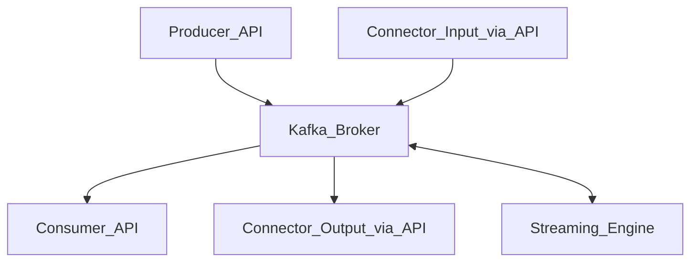

# Kafka
## What is it? 
* Essentially Kafka is a distributed commit log.  
* Kafka is a distributed data Store
* Optimized for injesting and processing LARGE amounts of data in real time
* Event Streaming Platform
* Scalable & Fault Tolerant
* Implements BOTH queuing and pub/sub messaging models 
* All data is stored as key value byte arrays
* Process
    * Producer (any app or service) sends data 
    * Kafka enqueues the data in a Log (a log is essentially an ordered queue)
        * Each Log has one or more Segment(s)
        * A segment is created for each subscriber to a log

* Kafka Server: 
    * Kafka Brokers (servers that manage writing/reading from logs)
    * Kafka APIs: 
        * Producer API - gets data into Kafka.  publishes data to a Kafka Topic
        * Consumer API - gets data out of Kafka. subscribes to topic(s) and gets sent data as it arrives at a topic
            * Request asks for a topic and an offset (offset says which record in the log do you want to return data from)
        * Streams API - used to receive data from a topic, transform it in some way, and output it to a different topic.  For example, if you subscribe to the "login_attempt" topic, you could take that login attempt, supplement it with an application name and then push the new message to a different topic that some other applications are subscribed to via consumer api.   
        * Connector API - allows you to add applications or data systems to push/pull data to/from kafka



## Core components
* Brokers - Storage nodes
* Log - Write only and immutable list of records
    * Size can be configured based on size or time (7 day default retention time for each topic)
* Topics - a logical grouping of events 
    * Events are stored in a log on the broker in a directory named after the topic
    * A topic can be anything.  You create topics based on how you want to add specificity to data being passed in.  For example, if you are using Kafka to monitor login activity.  You could create a topic for "login_attempt" where every login attempt would be grouped. 
* [Serdes](https://kafka.apache.org/30/javadoc/org/apache/kafka/common/serialization/Serdes.html) - Types that are defined and used inside Kafka
    * Name comes from: **SER**ialize and **DES**erialize
    * Can also use [Avro](https://avro.apache.org/docs/current/) to serialize/deserizalize complex Types
    ```
    final Map<string,string>serdeConfig = Collections.singletonMap(AbstractKafkaAvroSerDeConfig.SCHEMA_REGISTRY_URL_CONFIG, SCHEMA_REGISTRY_URL);

    final SpecificAvroSerde<WidgetType> widgetSerde = new SpecificAvroSerde<>();

    widgetSerde.configure(serdeConfig, false);
    ```
* Stream - unbounded sequence of structured data (commonly referred to as events)
* kStream - JAVA library abstraction over a stream.  representation of data where each piece of data is treated in isolation (immutable objects)
    * Does NOT live on the broker
    * Connects to a broker over the network via host:port
    ```
    final KStreamBuilder builder = new KStreamBuilder();
    
    final KStream<String, Widget> widgetEvents = builder.stream(Serdes.String(), widgetSerde, "widget-events");
    ```
* kTable - JAVA library abstraction over a stream where latest data is the data that is used (mutable objects).  
    * each kTable can subscribe to only one topic at a time
    * a kTable only focuses on one partition of it's topic at a time
    * backed by a state store (seems like a dictionary with the key of each record that comes in being the key of the state store dictionary)
    * uses "commit interval" or cahce size to determine when to push events.  Setting it to 0 would forward every event
    * kStreams forward EVERY event.  kTables only forward events when "commit interval" expires OR when cache size is exceeded.
* global kTable - same as kTable but stores ALL records across ALL partitions
    * used for smaller datasets that dont change much (i.e zip codes/country codes/etc)

## How
### Partition Distribution

